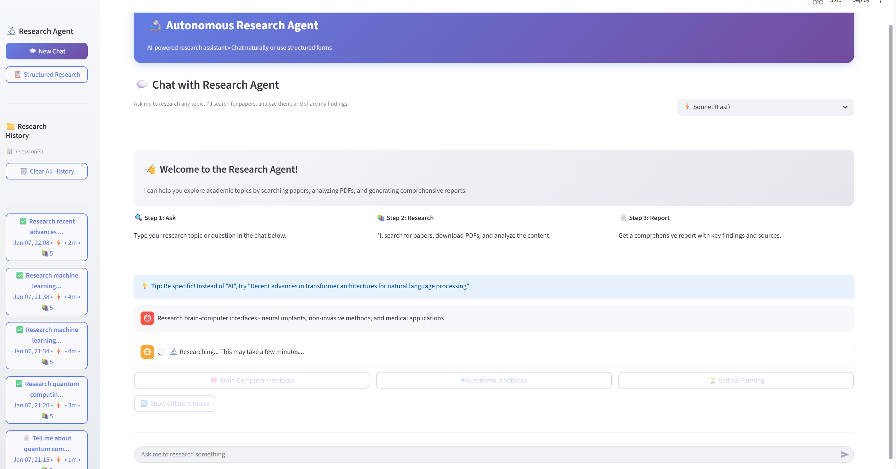
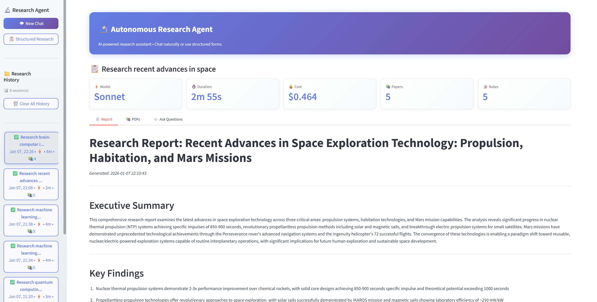
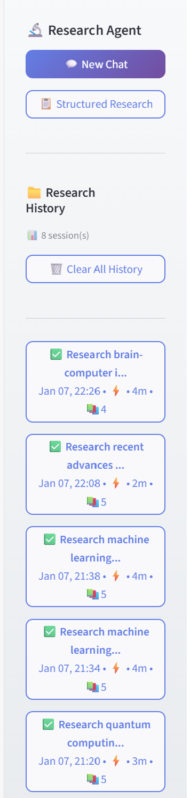

# Autonomous Research Agent

[](https://github.com/edarasumanth/autonomous-research-agent/actions/workflows/ci.yml)
[](https://codecov.io/gh/edarasumanth/autonomous-research-agent)
[](https://www.python.org/downloads/)
[](https://opensource.org/licenses/MIT)
[](https://github.com/edarasumanth/autonomous-research-agent/releases)

An AI-powered research assistant built with the Claude Agent SDK. This application autonomously searches for academic papers, downloads PDFs, analyzes content, and generates comprehensive research reports.

## Demo

<!-- TODO: Add demo GIF showing research workflow -->

*Watch the agent search, analyze papers, and generate a comprehensive report*

## Screenshots

### Welcome Screen

*Beautiful onboarding experience with 3-step guide for new users*

### Chat Interface

*Natural language research queries with real-time progress indicators*

### Research Results

*Comprehensive reports with paper summaries, key findings, and citations*

### Session Management

*Organized research history with status indicators and quick access*

## Features

### Core Capabilities
- **Chat-Based Research**: Natural language interface for research queries
- **Autonomous Workflow**: Searches, downloads, reads, and synthesizes papers automatically
- **PDF Analysis**: Extracts and analyzes content from academic papers
- **Report Generation**: Creates comprehensive markdown reports with citations
- **Session Management**: Organizes research by topic with persistent storage
- **Follow-up Q&A**: Ask questions about completed research sessions

### User Experience (v1.1.0)
- **Welcome Section**: Beautiful onboarding with 3-step guide for new users
- **Quick Research Topics**: 24 rotating research topics randomly selected each session
- **Model Selection**: Choose between Opus (Best), Sonnet (Fast), or Haiku (Quick)
- **Progress Tracking**: Real-time spinner and status updates during research
- **Session Metrics**: Duration, cost, paper count, and notes for each session
- **Clear History**: One-click cleanup with confirmation dialog

### Visual Enhancements
- Modern gradient UI with smooth animations
- Collapsible research notes grouped by type
- Enhanced metrics display with icons
- Status indicators (✅ Complete, 📝 In Progress, ⏳ Pending)
- Responsive sidebar with session cards

## Quick Start

### Prerequisites

- Python 3.11+
- Node.js 18+ (for Claude CLI)
- Docker & Docker Compose (for containerized deployment)
- API Keys:
  - [Anthropic API Key](https://console.anthropic.com/)
  - [Tavily API Key](https://tavily.com/)

### Setup

1. **Clone the repository:**
   ```bash
   git clone https://github.com/edarasumanth/autonomous-research-agent.git
   cd autonomous-research-agent
   ```

2. **Configure environment:**
   ```bash
   cp .env.example .env
   # Edit .env with your API keys:
   # ANTHROPIC_API_KEY=your_key_here
   # TAVILY_API_KEY=your_key_here
   ```

3. **Run with Docker (Recommended):**
   ```bash
   docker-compose up -d
   ```
   Access at: http://localhost:8501

4. **Or run locally:**
   ```bash
   # Windows
   scripts\start.bat local

   # Linux/Mac
   chmod +x scripts/*.sh
   ./scripts/start.sh local
   ```

## Usage

### Starting the Application

**Docker:**
```bash
docker-compose up -d          # Start
docker-compose logs -f        # View logs
docker-compose down           # Stop
docker-compose up -d --build  # Rebuild
```

**Local:**
```bash
# Windows
scripts\start.bat local
scripts\stop.bat local

# Linux/Mac
./scripts/start.sh local
./scripts/stop.sh local
```

### Using the Research Agent

1. **Open** http://localhost:8501 in your browser
2. **Choose a model**: Select Sonnet (fast), Opus (best), or Haiku (quick)
3. **Start researching**:
   - Type a query: "Research attention mechanisms in transformers"
   - Or click a **Quick Topic** button for instant research
4. **Wait** for the agent to search, download, and analyze papers (2-5 minutes)
5. **Review** the generated report in the Report tab
6. **Download** PDFs from the PDFs tab
7. **Ask follow-up** questions about the research

### Example Queries

- "Research transformer architectures in deep learning"
- "Find papers on CRISPR gene editing applications"
- "Investigate mixture of experts architectures"
- "Explore recent advances in quantum computing"
- "Research mRNA vaccine technology"

## Project Structure

```
autonomous-research-agent/
├── streamlit_app.py         # Web interface (main app)
├── chat_research_agent.py   # Chat-based research agent
├── web_research_agent.py    # Structured research agent
├── web_research_tools.py    # MCP tools (search, download, read)
├── requirements.txt         # Python dependencies
├── Dockerfile              # Docker image definition
├── docker-compose.yml      # Docker Compose configuration
├── .env.example            # Environment variables template
├── .dockerignore           # Docker build exclusions
├── docs/
│   └── screenshots/        # Application screenshots
├── scripts/
│   ├── start.bat           # Windows start script
│   ├── start.sh            # Unix start script
│   ├── stop.bat            # Windows stop script
│   └── stop.sh             # Unix stop script
└── research_sessions/      # Research output (auto-created)
    └── {timestamp}_{topic}/
        ├── pdfs/           # Downloaded papers
        ├── notes/          # Research notes (JSON)
        ├── report.md       # Generated report
        ├── metadata.json   # Session metadata
        └── completion.json # Completion stats
```

## Configuration

### Environment Variables

| Variable | Description | Required |
|----------|-------------|----------|
| `ANTHROPIC_API_KEY` | Anthropic API key for Claude | Yes |
| `TAVILY_API_KEY` | Tavily API key for web search | Yes |
| `STREAMLIT_PORT` | Port for web interface (default: 8501) | No |

### Docker Configuration

Edit `docker-compose.yml` to customize:
- Port mapping (default: 8501)
- Volume mounts for persistent storage
- Resource limits (CPU, memory)
- Environment variables

## Performance

| Metric | Value |
|--------|-------|
| Container CPU (idle) | ~1.4% |
| Container Memory | ~740MB / 4GB limit |
| First Response | ~10s (includes SDK warm-up) |
| Full Research | 2-5 minutes |
| Module Imports | <2s |

## Development

### Local Development Setup

```bash
# Create virtual environment
python -m venv venv

# Activate (Windows)
venv\Scripts\activate

# Activate (Linux/Mac)
source venv/bin/activate

# Install dependencies
pip install -r requirements.txt

# Run
streamlit run streamlit_app.py
```

### Building Docker Image

```bash
docker build -t research-agent .
docker run -p 8501:8501 --env-file .env research-agent
```

## Architecture

The application uses the Claude Agent SDK with MCP (Model Context Protocol) tools:

| Tool | Description |
|------|-------------|
| `web_search` | Search for academic papers using Tavily |
| `download_pdfs` | Download PDF files from URLs |
| `read_pdf` | Extract text from PDFs using pdfplumber |
| `save_note` | Save research findings as structured notes |
| `read_notes` | Retrieve saved notes for synthesis |
| `write_report` | Generate comprehensive markdown reports |

### Research Workflow

```
User Query → Web Search → Download PDFs → Read & Analyze → Save Notes → Generate Report
     ↑                                                                        ↓
     └──────────────────── Follow-up Questions ←─────────────────────────────┘
```

## Troubleshooting

### Common Issues

1. **"Failed to start Claude Code"**
   - Ensure Claude CLI is installed: `npm install -g @anthropic-ai/claude-code`
   - Check that Node.js is in PATH

2. **"API key not found"**
   - Verify `.env` file exists with correct keys
   - Restart the application after changing `.env`

3. **PDF download failures**
   - Some papers may be behind paywalls
   - The agent will continue with available papers

4. **Slow first response**
   - First query takes ~10s for SDK warm-up
   - Subsequent queries are faster

5. **Container not starting**
   - Check logs: `docker-compose logs -f`
   - Verify API keys in `.env` file

## Changelog

### v1.1.0 (2026-01-08)
- Added welcome section with 3-step guide
- Added 24 rotating quick research topics
- Added model selector with friendly labels
- Added Clear All History with confirmation
- Fixed quick topic button spinner
- Fixed session metadata saving
- Enhanced UI with gradients and animations

### v1.0.0 (2026-01-07)
- Initial release
- Chat-based research interface
- Autonomous research workflow
- PDF analysis and report generation
- Docker support

## License

MIT License - See [LICENSE](LICENSE) file for details.

## Acknowledgments

- Built with [Claude Agent SDK](https://github.com/anthropics/claude-code)
- Web interface powered by [Streamlit](https://streamlit.io/)
- Web search by [Tavily](https://tavily.com/)
- PDF processing by [pdfplumber](https://github.com/jsvine/pdfplumber)

---

**Made with ❤️ using Claude Code**
